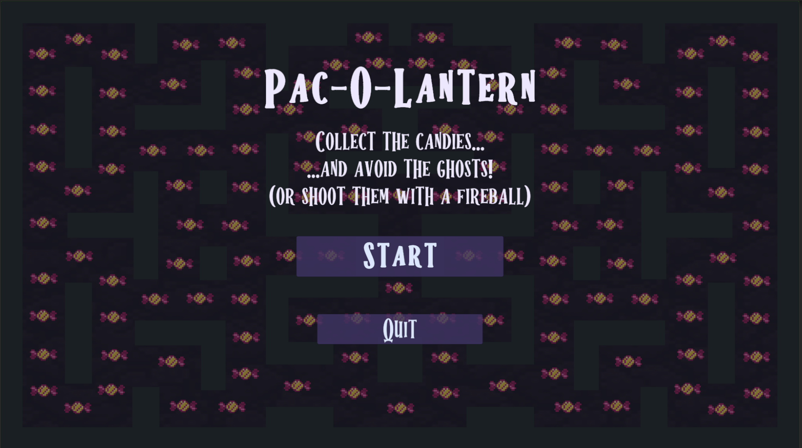
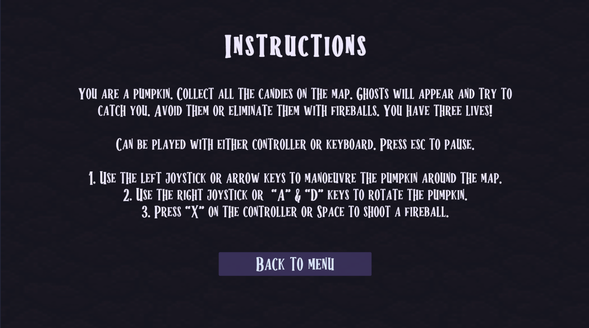
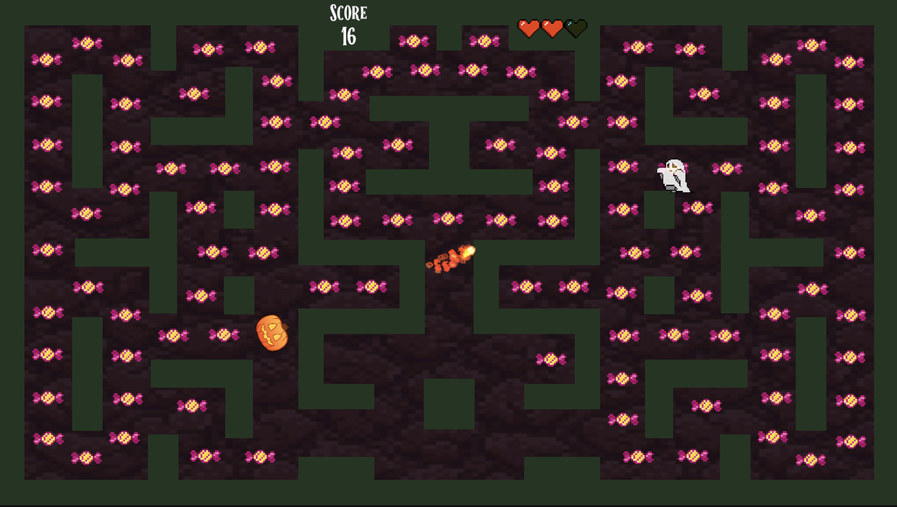
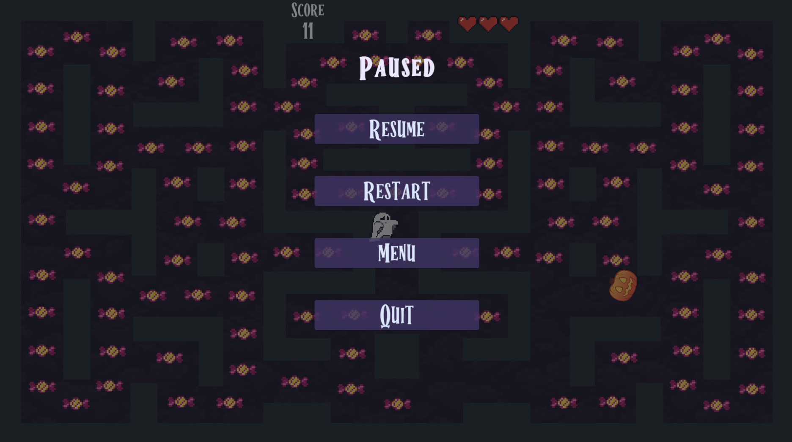
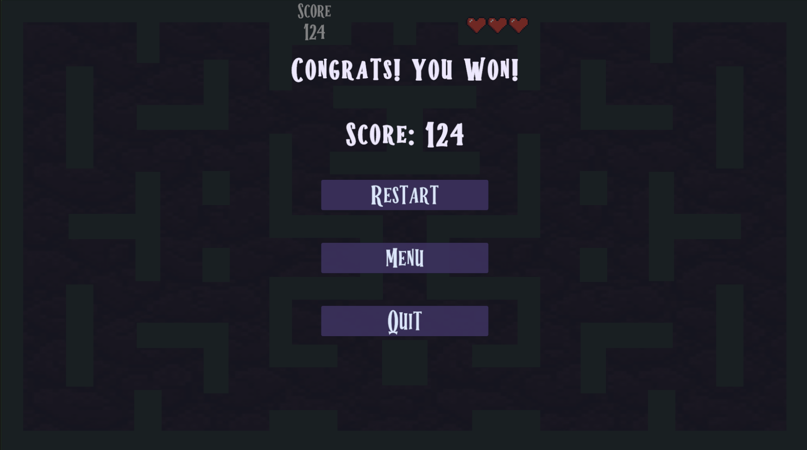
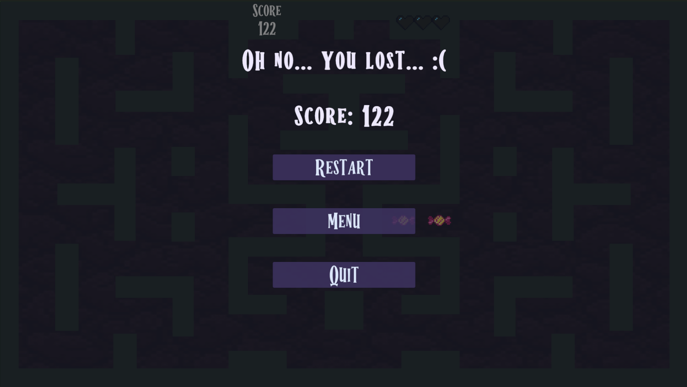

# Pac-O-Lantern
**Last updated: Oct 29, 2023**

## Boo!
Pac-O-Lantern is a 2D Arcade Game that I built as a weekly assignment for my COMP_SCI 376-0 Game Design class. It is a halloween-themed game loosely based on Pac-Man.

The player is a pumpkin, whose goal is to collect all the candies on the map. However, ghosts will randomly spawn and chase after you – you can either try to avoid them, or shoot them will fireballs!

You can either win by collecting all the candies, or lose by losing all three lives being hit by ghosts.

I really enjoyed making this game! I probably spent more time on it than I should've for just a weekly assignment, but I was excited to have more freedom and choice in the UI and gameplay design. I learned how to utilize audio and many more UI elements, as well as game mechanics such as scene management and so on.

I only made one level for my assignment, but hopefully one day I can add to it.

## Gameplay

The game is intended to be played with a controller, but it is configured for either controller or keyboard.

To play, open the project in the Unity Editor. It uses Unity 2022.3.10f1.

Then, open the "Menu" scene, from which you can start the game.

A build is also available to download in the "Build" folder of the repository, if you don't want to look at the code. Download and unzip the file, then run the application.

There are more detailed gameplay instructions in the INSTRUCTIONS.pdf file.

## Images

*Main Menu*

*Instructions*

*Gameplay*

*Pause screen*

*Win screen and message*

*Loss screen and message*

## Citations
Pumpkin Sprite:
https://opengameart.org/content/pumpkin  
Ghost Sprite:
https://ossiron.itch.io/pixel-ghost  
Candy Sprite:
https://opengameart.org/content/blinking-candy  
Fireball Sprite:
https://weisinx7.itch.io/fireballs-sprites  
Hearts Sprite:
https://nicolemariet.itch.io/pixel-heart-animation-32x32-16x16-freebie  
Background:
https://stock.adobe.com/images/ground-pattern-pixel-art-illustration/103323519  
Fonts:
https://www.1001fonts.com/halloween-spooky-font.html  
Score Beep SFX:
https://mixkit.co/free-sound-effects/game/?page=2  
Ghost Whoosh SFX:
https://opengameart.org/content/energy-drain  
Game Over (Lose) SFX:
https://mixkit.co/free-sound-effects/game-over/  
Game Over (Win) SFX:
https://mixkit.co/free-sound-effects/game-over/  
Background Music:
https://www.void1gaming.com/free-horror-music-pack